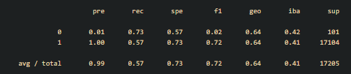
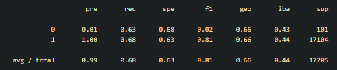
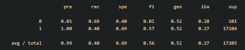
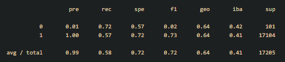
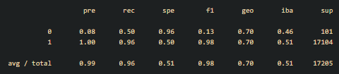
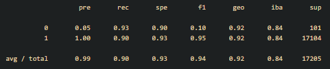

# Credit Risk Analysis
 
## Overview  
### Purpose  
The purpose of this project is to compare different machine learning models to see which ones are effecient in finding whether a person has low or high credit card risk. The dataset is unbalanced.

## Results  
Oversampling  
  

SMOTE Oversampling  
  

Undersampling  
  

SMOTEENN (Oversampling + Undersampling)  
  

Balanced Random Forest Classifier  
  

Easy Ensemble AdaBoost Classifier  
  

## Summary  
